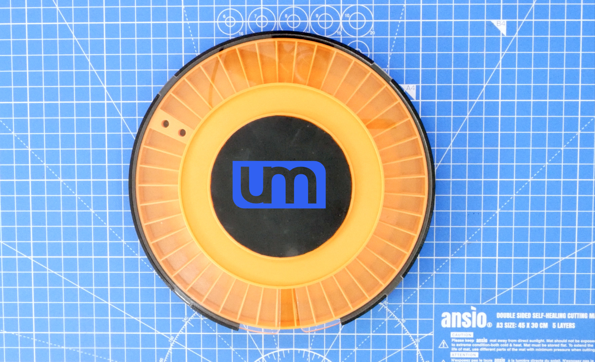

# Manual PnP Turntable V3

This Manual PnP Turntable is the latest version of my components storage & assembly turntable I initially designed way back in 2019!

I've been asked for the design files many times since I first showed it off in one of my videos, but the V2 version was just a terrible design from a construction stand point, and I always promised I'd release a newer version, and well, this is it!

## BETTER LATE THAN NEVER!

# Printing The 3D Pieces

### NOTE: The main parts for this turntable require a 3D printer with a print bed of 200mm x 200mm or larger.

There are 3 main 3d printed pieces that make up the turntable, plus some extras.

## turntable_V3_base.stl

- Layer height: 0.2mm
- Brim: Yes
- Supports: None

## turntable_V3_component_tray.stl

- Layer height: 0.2mm
- Brim: Yes
- Supports: Yes, from build plate + bridging

## turntable_V3_assembly_tray.stl

- Layer height: 0.2mm
- Brim: No
- Supports: Yes, from build plate + bridging

## The rest of the files

- Layer height: 0.2mm
- Brim: No
- Supports: None

# Laser cutting or printing the component cover

The component tray cover file is turntable_V3_cover_lasercut.dxf and should be cut out of 3mm thick acrylic, preferably clear, but frosted could also look good. Something transparent so you can see the components and labels inside.

If you can't get access to a laser cutter, you can 3d print the cover by printing turntable_V3_cover_3dprint.stl

# Bearings

These are the bearings I use on the turntable:

6805N Nylon (25x37x6mm)
https://s.click.aliexpress.com/e/_Am2lJV

Smaller (8x22x7mm)
https://s.click.aliexpress.com/e/_9AlN6x
   

# Assembly Instructions...

I made a video about the turntable and how to assemble it:

I hope you enjoy making and using this design. If you do, please contact me and let me know you made one and maybe send me a pic!

Cheers :)

# Support Unexpected Maker

I love designing, making and releasing my projects as open source. I do it because I believe it’s important to share knowledge and give back to the community, like many have done before me. It helps us all learn and grow.

That said, a lot of time, effort and finances have gone into designing and releasing these files, so please consider supporting me by buying some of my products:

https://unexpectedmaker.com/shop

https://www.tindie.com/stores/seonr/

Or by becoming a Patron:

https://www.patreon.com/unexpectedmaker

# Join my discord server
https://discord.com/invite/xAHpApP

# Unexpected Maker
https://unexpectedmaker.com

http://youtube.com/unexpectedmaker

http://twitter.com/unexpectedmaker

https://www.facebook.com/unexpectedmaker/

https://www.instagram.com/unexpectedmaker/
